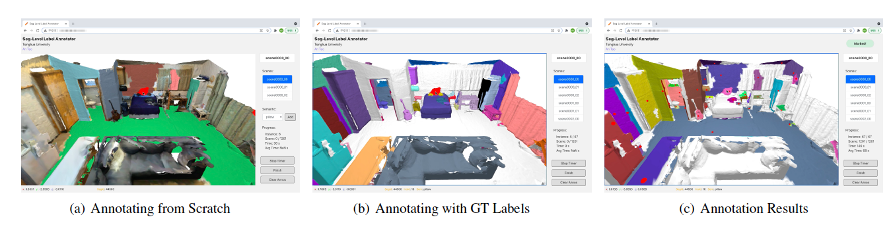

# SegGroup.annotator

[[中文版]](README_zh.md)

<p float="left">
    
</p>

This repository contains the Seg-Level Label Annotator for the paper **SegGroup: Seg-Level Supervision for 3D Instance and Semantic Segmentation** 

[[arXiv]](https://arxiv.org/abs/2012.10217) [[Code]](https://github.com/antao97/SegGroup) [[Zhihu]](https://zhuanlan.zhihu.com/p/536482202) 

We design a WebGL annotation tool in the browser to annotate seg-level labels. The tool is developed with [React](http://reactjs.org) and [three.js](https://threejs.org/).

**Video:** [[YouTube]](https://www.youtube.com/watch?v=HPVbzQTURus) [[Bilibili]](https://www.bilibili.com/video/BV1Av411h7BA/)


If you find our work useful in your research, please consider citing:
```
@article{tao2022seggroup,
  title={{SegGroup}: Seg-Level Supervision for {3D} Instance and Semantic Segmentation},
  author={Tao, An and Duan, Yueqi and Wei, Yi and Lu, Jiwen and Zhou, Jie},
  journal={IEEE Transactions on Image Processing},
  year={2022},
  volume={31},
  pages={4952-4965},
  publisher={IEEE}
```

In [here](https://github.com/antao97/SegGroup/tree/main/seggroup/dataset/scannet/manual_label.zip) we provide our manual annotation results.

**Updates:** 

- [2022/07/01] This work is accepted by IEEE Transactions on Image Processing!

&nbsp;

## Usage

### Install Node.js

Download a pre-built installer for your platform from https://nodejs.org/en/download/.

### Download the repo

```
git clone https://github.com/AnTao97/SegGroup.annotator.git
```

Enter `annotator/` to annotate labels from scratch or `annotator_with_gt/` to annotate labels with ground-truth labels. In the following steps, we take `annotator/` for example.

```
cd annotator/
```

### Download the ScanNet dataset

Our annotation tool uses .PLY scans from ScanNet. Please follow the [instructions](https://github.com/ScanNet/ScanNet#scannet-data) to download.

### Prepare soft links

Add a soft link to the downloaded ScanNet dataset (use absolute path).

```
ln -s DATASET_ABSOLUTE_PATH public/data/scannet
```

Create a folder anywhere outside this repo to save annotated labels. Add a soft link to the label folder (use absolute path).

```
ln -s LABEL_ABSOLUTE_PATH public/data/label
```

### Start the application

Start the file writer:
```
node fileWriter.js
```

Start the Web interface:

```
npm install
npm start
```

Open [http://localhost:3000](http://localhost:3000) to view it in the browser.

&nbsp;

## Instruction

The interface includes a scene display window on the left and a control panel on the right. The annotator can rotate and pan the scene to browse and annotate seg-level labels by mouse clicking. 

### Annotation from Scratch

In this annotation mode, the scene is displayed with original scanned colors at the beginning. 

The annotator needs to choose a semantic class before annotating the location of each instance. If the next instance to annotate shares the same semantic class with the last annotated instance, the annotator only needs to click on `Add` in the control panel to use the last chosen semantic class. 

To show the over-segmentation results to facilitate annotation, the segment corresponding to the mouse cursor is displayed in red. 

When an instance location is annotated, the color of the segment that corresponds to the instance location changes from red to a new color to indicate the segment is annotated. Different colors of the annotated segments indicate they belong to different instances. 

### Annotation with Ground-Truth (GT) Labels

Because scenes in the ScanNet dataset have ground-truth point-level labels, in our paper we choose to annotate our seg-level labels based on the ground-truth labels to reduce the annotation difficulty. 

Compared with annotating from scratch, in this annotation mode the annotator does not need to annotate the semantic class of each instance location. 

In the scene display window, different colors indicate different instances, and the white color indicates instances are labeled. The scene is displayed with non-white colors at the beginning of the annotation process. 

The annotator needs to annotate on every instance to make the scene become white in all areas. 

The segment corresponding to the mouse cursor is also displayed in red. 

When an instance location is annotated by mouse clicking, the color of the segment that corresponds to the instance location changes from red to black. At the same time, the color of the instance last labeled turns white to indicate this instance is already labeled. 

### After Annotation

The annotation results include location annotations and seg-level labels. 

For seg-level labels, different colors indicate they belong to different instances. The white areas of the scene are unlabeled. The positions of red balls indicate the location annotations of instances. 

&nbsp;

## Control

Left Mouse Button + move: Pan the scene

Right Mouse Button + move: Rotate the scene

Mouse Wheel: Zoom up and down

A/D: Previous/Next scene

Space: Show over-segments

F: Change color

H: Reset camera

Q: Show original scanned mesh

### During annotation

Shift + Left Mouse Button: Add annotation

Z: Remove last annotation

### After annotation

E: Show location annotations 

W: Exchange between annotations and ground-truth labels (only valid with ground-truth labels)

&nbsp;
## Reference repos:
- [point-cloud-annotator](https://github.com/zexihan/point-cloud-annotator)  
